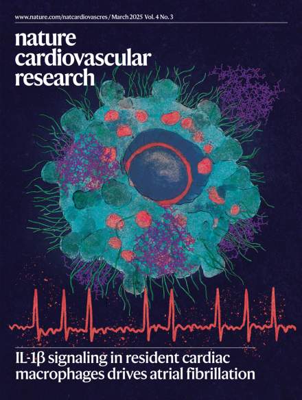

# Fibrilação Atrial e Inflamação: A Descoberta do Prof. Emiliano Medei que Conquistou a Capa da Nature

A Fibrilação Atrial (FA) é a arritmia cardíaca mais frequente na prática clínica, aumentando significativamente o risco de AVC e insuficiência cardíaca. Mas o que realmente causa esse "descompasso" no átrio do coração? O grupo de pesquisa do [Prof. Emiliano Medei](/pessoas/coordenacao/emiliano-horacio-medei.qmd) publicou um estudo de impacto global que traz uma resposta inovadora: a culpa pode estar em nossas células de defesa.

::: {.columns}
::: {.column width="40%"}

{width="80%"}

:::
::: {.column width="60%"}

## O Vilão Invisível: A Interleucina-1β

Os cientistas já sabiam que pacientes com altos níveis de uma proteína inflamatória chamada IL-1β tinham mais chances de desenvolver arritmias. O estudo do Prof. Emiliano provou essa conexão de forma direta: a exposição contínua a essa proteína cria um ciclo vicioso de inflamação que "cicatriza" (fibrose) o tecido do coração e altera sua parte elétrica.

:::
:::

## A Surpresa: O Coração não é o único culpado

A grande virada dessa pesquisa foi identificar quem responde à inflamação. Usando tecnologia de ponta, a equipe demonstrou que o problema não começa diretamente nas células musculares do coração (os cardiomiócitos), mas sim nos macrófagos residentes — células do sistema imune que moram dentro do coração.

* O Mecanismo: A proteína IL-1β ativa um receptor nesses macrófagos, que passam a produzir ainda mais inflamação.
* O Curto-Circuito: Esse processo encurta o tempo de recuperação elétrica do átrio esquerdo, deixando o coração "irritável" e propenso a entrar em fibrilação.

## Tratamentos do Futuro

Ao desativar especificamente o receptor de inflamação nesses macrófagos, os pesquisadores conseguiram prevenir a arritmia. Isso muda tudo! Em vez de apenas tratar o sintoma elétrico com antiarrítmicos comuns, a ciência agora olha para terapias que interrompem o ciclo inflamatório na origem.

> "Essas descobertas oferecem uma nova perspectiva terapêutica: focar na sinalização da IL-1β pode ser a chave para tratar pacientes com Fibrilação Atrial que não respondem bem aos tratamentos convencionais," destaca a pesquisa.

Para o INTERAS, divulgar este marco — que merecidamente foi capa de uma das maiores revistas científicas do mundo — é reforçar a importância da pesquisa básica de excelência para a criação de uma medicina mais precisa e humana.

Para ler o artigo original (em inglês): [IL-1β enhances susceptibility to atrial fibrillation in mice by acting through resident macrophages and promoting caspase-1 expression](https://doi.org/10.1038/s44161-025-00610-8)

DOI: https://doi.org/10.1038/s44161-025-00610-8
