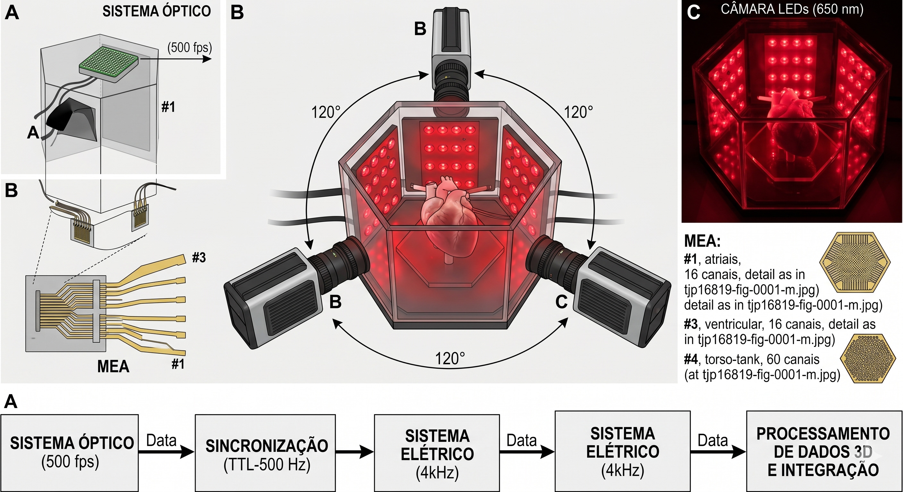
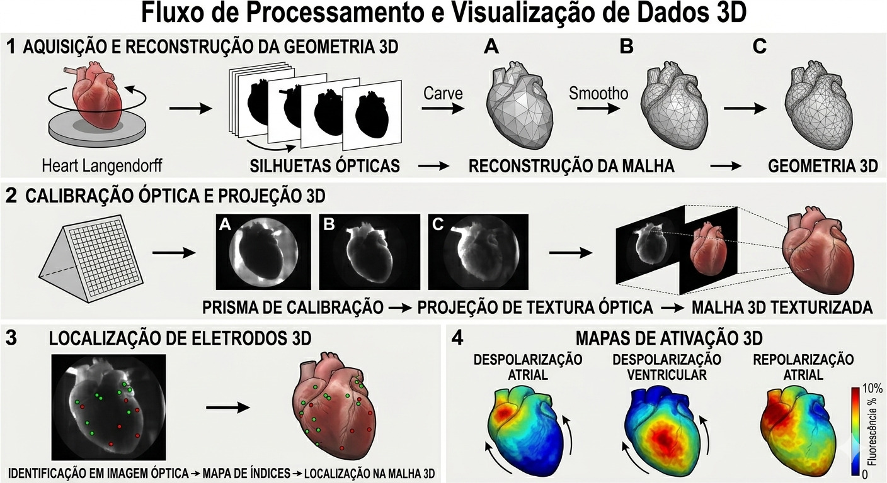

## O Desafio de Mapear o Caos Elétrico

As arritmias cardíacas, como a fibrilação atrial, continuam sendo um dos grandes desafios da eletrofisiologia clínica. Para tratar essas condições — muitas vezes utilizando a ablação por cateter, que "queima" o foco do problema, é fundamental entender a dinâmica complexa da atividade elétrica do coração.

Atualmente, os médicos utilizam o mapeamento elétrico invasivo (com cateteres) ou não invasivo (como eletrodos no tórax). No entanto, esses métodos enfrentam obstáculos significativos: baixa resolução espacial, dependência da direção de propagação da onda e interferências de sinais distantes (efeitos *far-field*). O resultado é uma visão muitas vezes incompleta da eletrofisiologia real, o que pode reduzir o sucesso dos tratamentos.

Mas e se pudéssemos literalmente *ver* a eletricidade se propagando célula a célula?

## A Solução: Luz, Câmeras e Eletricidade

::: {.columns}
::: {.column width="60%"}

{width="95%"}

:::
::: {.column width=40%}

Para superar as limitações das tecnologias atuais, pesquisadores do HEartLab (Universidade Federal do ABC), com apoio de parceiros internacionais, criaram uma plataforma experimental inédita, detalhada no periódico britânico *The Journal of Physiology*. O sistema integra três modalidades de mapeamento em corações isolados de coelhos:

:::
:::

1. **Mapeamento Óptico Panorâmico 3D:** Utilizando corantes fluorescentes sensíveis à voltagem (Di-4-ANBDQPQ) e três câmeras de alta velocidade dispostas a 120 graus, o sistema captura os potenciais de ação transmembrana em alta resolução espacial (500 quadros por segundo) sem precisar encostar no tecido.
2. **Mapeamento Elétrico Epicárdico:** Matrizes de múltiplos eletrodos (MEAs) customizadas e acopladas diretamente na superfície dos átrios e ventrículos.
3. **Modelo "Torso-Tanque" para ECGi:** O coração é imerso em um tanque contendo uma solução que simula a condutividade do tórax, equipado com 60 eletrodos superficiais.

## O Pulo do Gato Computacional: Resolvendo o "Problema Inverso"

Do ponto de vista de extração de dados e modelagem computacional, a plataforma é um prato cheio. O mapeamento óptico mede o potencial celular transmembrana de forma direta, enquanto os eletrodos clínicos medem o potencial extracelular. 

Para interligar esses mundos, o estudo utiliza a **Imagem Eletrocardiográfica (ECGi)**. Através do processamento de sinais do "torso-tanque", a equipe reconstrói os eletrogramas epicárdicos resolvendo a equação de Laplace no volume condutor. Como esse é um problema inverso mal posto (onde pequenas variações nos dados podem causar enormes erros na reconstrução), os cientistas estabilizaram o sistema aplicando a regularização de Tikhonov de ordem zero, otimizada pelo método da Curva-L.

::: {.columns}
::: {.column width="60%"}

{width="95%"}

:::
::: {.column width=40%}

Além disso, a geometria 3D do coração foi reconstruída utilizando técnicas de segmentação interativa e algoritmos de Poisson, permitindo que a malha geométrica 3D fosse perfeitamente alinhada (projetada) com os dados ópticos 2D capturados pelas câmeras.

:::
:::

## Resultados: Onde a Clínica Encontra a Célula

Os testes em ritmos sinusais, taquicardia ventricular e fibrilação atrial validaram a integração do sistema. Durante o ritmo sinusal e a taquicardia ventricular, a propagação da frente de onda elétrica e óptica apresentou grande concordância. A análise de Frequência Dominante (DF) extraída via transformada rápida de Fourier (FFT) também obteve alta correlação entre os sinais ópticos, elétricos invasivos e reconstruídos do tanque.

Contudo, durante arritmias atriais mais caóticas, surgiram pequenas divergências espaço-temporais entre as estratégias de mapeamento. E é exatamente aqui que reside o valor desta plataforma: ao cruzar a altíssima resolução do mapeamento óptico com a visão dos eletrodos convencionais, os pesquisadores conseguem entender as limitações dos sistemas comerciais de mapeamento, oferecendo uma bancada de testes (*test bed*) incrivelmente detalhada para avaliar novos fármacos antiarrítmicos e aprimorar as intervenções ablativas.

Para ler o artigo original (em inglês): [An integrated platform for 2-D and 3-D optical and electrical mapping of arrhythmias in Langendorff-perfused rabbit hearts](https://doi.org/10.1113/JP287815)

DOI: https://doi.org/10.1113/JP287815

